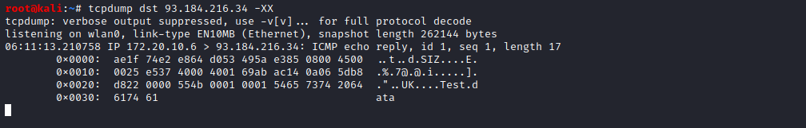
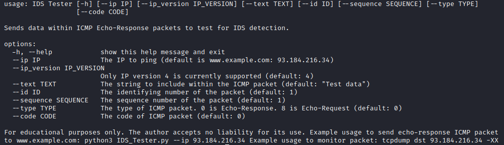

# IDS Tester

It may be possible to avoid detection by IDS (Intrusion Detection System) software by using specific types of ping packets.

This can prove a vulnerability issue for some IDS software. IDS software may capture ping requests (ICMP type 8) to a malicious server, but not ping replies (ICMP type 0). 
By sending an ICMP packet of type 0 (Echo-Reply), it may be possible to avoid IDS detection. These packets can contain additional data. Should IDS software not capture these packets, potential data could be leaked from the host computer, such as keylog data and password data.

This software will construct an ICMP packet so that IDS software can be tested for this vulnerability. This software has been tested on IDS software, and information has been successfully leaked to denied websites without any log entry being made by the IDS software.

The author accepts no liability for this source code and is provided for educational purposes only.

Example usage:

Sending a default ping packet (ICMP packet, Echo-Response)...

Viewing the raw data being sent...

Help information...

